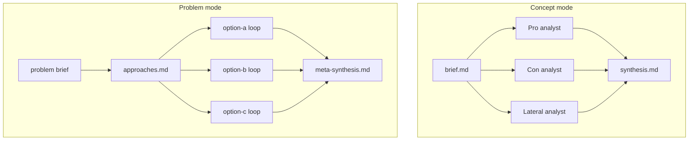

# Concept Evaluation Loop

Multi-agent evaluation for ideas and problems. One slash command, two auto-detected modes:

| Mode | Trigger examples | Flow |
|---|---|---|
| **Concept** | "Should we…", "Is X a good idea" | Pro / con / lateral analysts → synthesis |
| **Problem** | "How do we…", "What's the best way to…" | Brainstorm N approaches → loop each → meta-synthesis |

Built for **Cursor** and **Codex-style agent harnesses**. The orchestrator spawns three isolated analysts in parallel, then synthesizes a recommendation with links to full artifacts.

## Quick start

```bash
# From your target project root:
git clone https://github.com/YOUR_ORG/concept-evaluation-loop.git /tmp/concept-evaluation-loop
bash /tmp/concept-evaluation-loop/scripts/install.sh
```

Then in Cursor chat:

```
/concept-evaluation-loop Should we add a subscription tier?
/concept-evaluation-loop How do we reduce churn for repeat buyers?
```

## How it works



**Isolation rules** (non-negotiable):

- Pro and con run in parallel on the same brief — con never sees pro.
- Lateral never sees pro or con before writing.
- Problem mode: each approach gets a full isolated loop before meta-synthesis.

## Installation

### Option A — install into a project (recommended)

```bash
bash scripts/install.sh
# or from anywhere:
bash /path/to/concept-evaluation-loop/scripts/install.sh /path/to/your-project
```

This copies:

| Source | Destination |
|---|---|
| `skill/` | `.agents/skills/concept-evaluation-loop/` |
| Cursor stub | `.cursor/skills/concept-evaluation-loop/SKILL.md` |
| `evaluations/README.md` | `evaluations/README.md` (or `.codex-harness/evaluations/` if harness detected) |

### Option B — global Cursor skill (all projects)

```bash
bash scripts/install.sh --global
```

Installs to `~/.cursor/skills/concept-evaluation-loop/` and `~/.agents/skills/concept-evaluation-loop/`.

### Option C — manual

1. Copy `skill/` → `.agents/skills/concept-evaluation-loop/`
2. Copy `evaluations/README.md` → `evaluations/README.md` in your project
3. Optionally copy `brain-template/` → `brain/` for timeline logging

## Usage

| Input | Behavior |
|---|---|
| `/concept-evaluation-loop` | Ask what to evaluate or solve |
| `/concept-evaluation-loop <brief>` | Auto-detect concept vs problem mode |
| `/concept-evaluation-loop <brief> --options 4` | Problem mode, force 4 approaches |
| `/concept-evaluation-loop <brief> outcome: <goal>` | Explicit desired outcome |

**Flags (problem mode):** `--options N` (1–5), `--concept`, `--problem`

### Output layout

**Concept mode:**

```
evaluations/<eval-id>/
  brief.md
  pro.md, against.md, lateral.md, synthesis.md
```

**Problem mode:**

```
evaluations/<eval-id>/
  brief.md
  approaches.md
  option-a/  → brief.md, pro.md, against.md, lateral.md, synthesis.md
  option-b/
  option-c/
  meta-synthesis.md
```

Eval ID format: `<subject-slug>-YYYY-MM-DD`

See [examples/subscription-tier-2026-01-15/](examples/subscription-tier-2026-01-15/) for a complete concept-mode sample.

## Repository structure

```
concept-evaluation-loop/
├── README.md
├── skill/
│   ├── SKILL.md              # Orchestrator — attach or invoke as /concept-evaluation-loop
│   └── references/           # Analyst prompts and output templates
├── evaluations/
│   └── README.md             # Artifact layout (installed into consumer projects)
├── examples/                 # Sample evaluations (not installed)
├── brain-template/           # Optional timeline logging for harness projects
└── scripts/
    └── install.sh
```

## Optional brain integration

If your project uses a `brain/` knowledge base, copy `brain-template/domains/concept-evaluation/` into `brain/domains/concept-evaluation/`. Material evaluations can be logged to the Timeline.

## Contributing

PRs welcome. Keep analyst prompts isolated — pro/against/lateral must not cross-read.

**Note:** The con analyst writes to `against.md` (not `con.md`) because `CON` is a reserved device name on Windows and breaks git checkouts.

## License

MIT — see [LICENSE](LICENSE).
